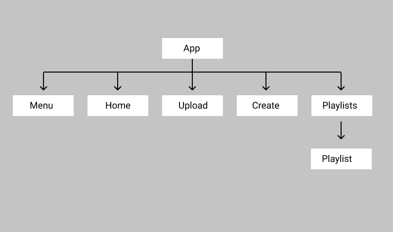

# YT-Playlists-Organiser

The current version of the site is live at: https://yt-playlists-organiser.herokuapp.com/

As the name suggests, the intention for this project is to be able to fetch, load, organise and manage playlists (of videos specifically from YouTube at the moment). That is to say, enable Creating, Reading, Updating and Deleting (CRUD operations on) playlists and their videos.

Tested with hosting it on Heroku and works as good as on local machine. It will require some (mostly security-related) preparations before the project website is made public. 

## Current Progress
Early stages are complete. You can upload an existing playlist or create anew, and view it. Lists of all playlists are available, and can also delete any playlist so far.

Next stage: Refactor code esp. server side and package.json. Start adding core features such as enabling adding a new video to playlist, re-arranging or removal of videos.

## Component Hierarchy
A brief component hierarchy.

## How to run this on your machine
Clone this repo to your local/virtual machine. Make sure you have MongoDB and Node running on your machine, and have either Yarn or NPM installed.

Then in your IDE, open terminal and either run `yarn install` or `npm install`. 

Get a YOUTUBE API key and save it in a **.env** file at root path yt-playlists-organiser/

You may need to create the database as well as collection named _'playlists'_ on your Mongo. 

Last but not least run `yarn dev` or `npm run dev` and go to **localhost:3000** or whatever port you choose on the browser.
